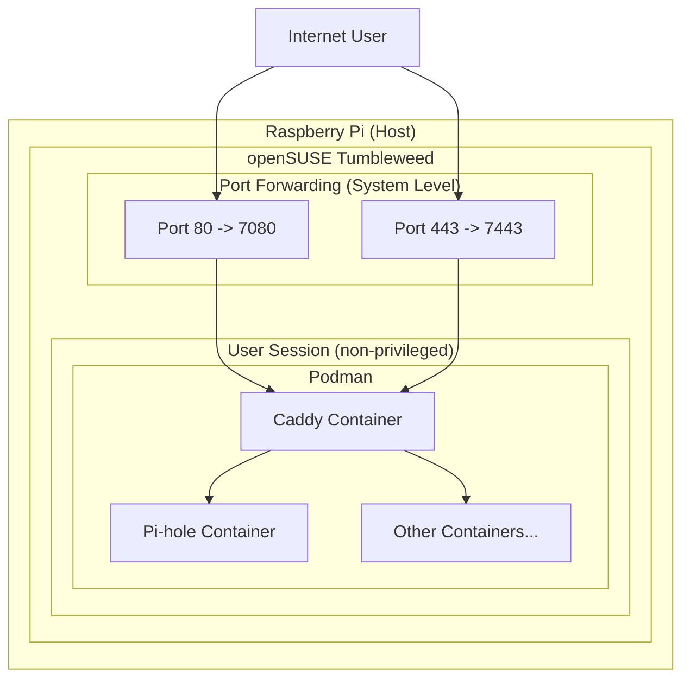

# Curated Quadlets for a Home Server

A collection of curated Quadlet files for running various services on a home server. This setup is designed to be simple, secure, and easy to manage.

## Architecture

This setup runs on a Raspberry Pi with openSUSE Tumbleweed as the operating system. It leverages Podman and Quadlets to manage containerized services.

### Security
A key feature of this setup is that all containers are run by a **non-privileged user**. This enhances security by isolating the containers from the host system. To expose services on privileged ports (like 80 and 443), TCP port forwarding is used at the system level, redirecting traffic to the higher ports used by the containers.

### Architecture Diagram

## Services

The following services are available as Quadlets in this collection:

*   Caddy
*   Caddynet
*   Cloudflared
*   Filegator
*   Homarr
*   Jellyfin
*   Metube
*   OpenCloud
*   Pi-hole

## Usage

1.  Place the `.container` and `.network` files in `~/.config/containers/systemd/`.
2.  Run `systemctl --user daemon-reload`.
3.  Start a service with `systemctl --user start <service-name>.service`.

_Note: This setup is highly customized for a specific environment. You will likely need to adjust file paths and other settings to match your own setup._